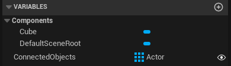

## Prologue
I have created these challenges to learn Unreal Engine so I definitely am not sure if what I present is the best way to solve the challenge. If you find better solutions I'd be happy to hear about it!

## What I learned from this challenge
Setting properties to public, working with arrays, casting, how to work with physics and collisions

# Challenge 01 - Trigger

My first challenge is to create a trigger. The idea is to create a cube that acts like a trigger and if the user enters the area it should make objects that hang in the sky fall down. Should be ok, right?

## Solution

First I created a project using the first person template with Blueprints, Desktop, Maximum Setting and Starter Content enabled;


My idea for the solution is as follows;
* I need a blueprint for an object to act as a trigger
* I want the object to be visible but you should not collide with it
* It should be possible to assign connected objects to the trigger, this way you can use the editor to setup the objects that fall down once you collide with a trigger
* I need a blueprint for the falling object and it should not fall down until it is triggered to fall down
* I need a way to make the objects fall down once the trigger is ..well.. triggered! 

### I need a blueprint for an object to act as a trigger
I created a blueprint class and called it BP_Trigger. So far so good. I added a Cube and changed the color and that's it.


### I want the object to be visible but you should not collide with it
The way to do this is to set the collision preset of the cube to ```Trigger```. This way you will not collide with it but it will still fire events if you enter the area.


### It should be possible to assign connected objects to the trigger
This is easy once you know how to deal with variables. I have added ```ConnectedObjects``` variable of type ```Actor | Object Reference``` and I have made an array out of it so you can assign multiple objects to the trigger. Also don't forget to set the visibility of this variable to visible by clicking on the closed eye. Once you have made this variable public (by making sure the eye is open) you are able to set the variable using the editor. I will show you later.



### I need a blueprint for the falling object
I created another blueprint class this time called ```BP_Drop``` and added a Sphere. To make sure it won't fall down at the start of the game I have disabled the ```enable gravity``` option. You can find this if you select the sphere and look under the ```physics``` tab. 


Next up I setup a scene in the firstperson map where I added a BP_Trigger and a BP_Drop instance;


Because of the public ```ConnectedObjects``` variable I can use the ```Pick Actor from Scene``` option and assign a BP_Drop to the Trigger. Now the trigger is connected to a object that should fall. I could add more BP_Drop instances but one will do for now.


### I need a way to make the objects fall down once the trigger is triggered!

Now we need to setup some code. Let's start with the BP_Drop. The only thing we need to do here is to add a custom event which will enable gravity again (remember that I disabled this earlier so the object will hang in the sky at game start). Let's call this custom event ```EventDrop```. You can use the ```Set Enable Gravity``` function to true like so;


Now we switch to the Event Graph of BP_Trigger and here it is a little more complex but still actually quite straightforward. First we need to connect to the event, looking at the events we see that we have the `On Component Begin Overlap` event, let's connect to this!


Ok, so now we now that we have the trigger. The next thing we need to do is call the custom event ```EventDrop``` of every object in the ```ConnectedObjects``` array. For this we need a for each loop, cast the array element to a BP_Drop (casting means that you tell the code what kind of object the element in the array is.. if you wouldn't do that the array element type would not be known). Now we casted the array element to a ```BP_Drop``` we can call the ```EventDrop``` that we created. It looks like this;


### Done

So now it's done! Once you walk through the trigger you will see that the connected object(s) will fall down. Click on the video thumbnail to see the YouTube video.

[](https://www.youtube.com/watch?v=dXGWzXxOHqM)

Mission accomplished.. next!

**Note** There are some things that could be improved. Now any object entering the trigger will trigger the objects to fall down, so NOT only the player. You could avoid this by maybe adding a tag to the player and check the tag of the object that entered the trigger. Also note that casting to ```BP_Drop``` could go wrong if I picked another blueprint class as part of the connected objects. In that case it would be a good idea to connect to the ```Cast Failed``` flow and maybe show a debug error.

[Back to all challenges](../README.md)
