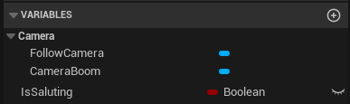
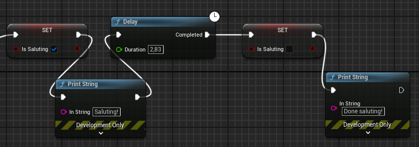
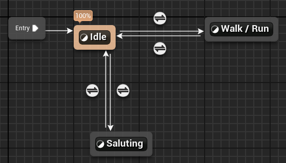

## Prologue
I have created these challenges to learn Unreal Engine so I definitely am not sure if what I present is the best way to solve the challenge. If you find better solutions I'd be happy to hear about it!

## What I learned from this challenge
Converting and using mixamo animations, using the input system, using the animation states, accessing player properties

# Challenge 02 - Keyboard and animation

My second challenge deals with key presses and starting a new animation based on the key press. So for this challenge I chose to listen to key ```F``` and if that is pressed I want my character to play an animation I downloaded from [mixamo](https://www.mixamo.com/). I will show you the steps to do this here.

The animation I downloaded is the ```salute``` animation and I used the following download settings;


and the animation looks like this;


Let's get going!

## Solution

Ok, so I really upped the challenge with this one.. it wasn't easy to solve but it worked! My starting point was the 3rd person template with starter content. Now we already have a character, some animations, an animation controller and a input method. Let's take it from there.

### Get a new animation from [mixamo](https://www.mixamo.com/) 

Unfortunately it is not possible to directly download an animation and expect it to work for Unreal. I found this really useful video about a [mixamo converter](https://www.youtube.com/watch?v=nYVjpHlabVM&ab_channel=TerribilisStudio) which does the job. I will not explain it here because the video is short and tells you how to do it but I will link to this [download](Salute.UE.fbx) with the converted animation that you can use directly in UE5. Note that I do not take any responsibility for corrupt files or the software from terribilis studio (and don't worry, the software is legit or just use your anti virus software)

Once I had the animation I added it to the ```Content | Characters | Mannequins | Animations | Manny``` folder since I am using the Manny UE5 model. I then clicked ```Reset to Default``` and used the ```SK_Mannequin``` as the Skeleton during the import because this is the default UE5 mannequin in the template. I called the imported animation ```MM_Salute```.


### Adding the key press

I want my character to play the ```salute``` animation if I press the F-key. If you look up some tutorials there are ways to directly link to a key press but I want to make use of the already available ```IMC_Default``` class which you can find under ```Content | ThirdPerson | Input```. You can add new key inputs in the ```Actions``` map by creating a new ```Input Action```. 


I called mine ```IA_Salute```. Next up I entered the ```IMC_Default```, added a mapping (using the plus sign) and selected the ```IA_Salute``` input action and assigned the F key by clicking on the keyboard icon (to start listening to input) and pressing the F-key.


### Adding the saluting state to my character

The next idea was to somehow tell my character that is was saluting or not. In ```BP_ThirdPersonCharacter``` which is the character we are controlling I added a new variable called ```IsSaluting``` and put this as a boolean (true / false) type. 



Now it was easy to add the logic to respond to the key press. If the key is pressed and we are not already saluting (in which case ```IsSaluting``` would be true) we want to set ```IsSaluting``` to true. 


Now I encountered a problem.. if we press the key we will forever have set ```IsSaluting``` to true. How do I know my animation has ended?

**NOTE this is still a question and I solved it my way but if you know the answer let me know!**

My solution was to just add a delay that takes as long as the animation and then set ```IsSaluting``` back to false. It works but I would love to know if there is some kind of way / event to know that the animation has ended and then set the ```IsSaluting``` variable to false.. that seems more robust. Anyway, now my code looks like this;


Note that you can find the length of the animation by going into the animation montage ```MM_Salute``` and look at the chart. For me it was around 2.83 seconds.

I also shortly added a debug message to see if it works.. this is really helpful during debugging.



* Play the animation

Now we come to the difficult part.. for me at least ;-).. how to start and end the animation?

First I discovered I had to set up the transition between the states in the animation blueprint ```ABP_Manny```. The logical place seemed to be in the ```Locomotion State Machine```. If you double click on this you will enter the state transition screen. We already have ```Idle``` and ```Walk / Run``` and I added a ```Saluting``` state from ```Idle```. Simply drag a line from ```Idle``` down and choose ```add state```. 



This will initially create one line from ```Idle``` to ```Saluting``` so I also added the line back from ```Saluting``` to ```Idle```. If you then double click on the ```Saluting``` you can select the animation to play by dragging ```MM_Salute``` in the Asset Browser to the screen and connect it to the ```Output Animation Pose```. This simply tells that if we enter the ```Saluting``` state we should play the ```MM_Salute``` animation.


Next up is to set up the line from ```Idle``` to ```Saluting``` and back by defining when to enter or exit the state. For this I added a new variable called ```IsSaluting```. Remember that we also have this variable in our ```BP_ThirdPersonCharacter```. Once this is done we can doubleclick on the line from ```Idle``` to ```Saluting``` and simply use this rule;


Now we assign the transition from ```Saluting``` to ```Idle``` by clicking on that line and enter this code;


That was easy but how do we connect the player ```IsSaluting``` property to the animationblueprint ```IsSaluting``` property?

### Start and end the animation

To connect the player with the animation player and tell the animation player when the player has pressed the 'salute' key we need to go to the ```Event Graph``` of the animation player. Note that there is already some code there and we will build upon that.

The first thing to note is that the code already adds a character property which is set in the ```Event Blueprint Initialize Animation``` event. That means that we can use this variable called ```Character``` to access the character.


The first code I tried was the following (and note that you need to cast the ```Character``` property to a ```BP_ThirdPersonCharacter``` to be able to access the properties!);


It reads like 'get my character, cast it to the one I made and set the animation ```IsSaluting``` property to the value of the characters ```IsSaluting``` property.

To make sure it executes I have added a pin to the ```Sequence``` and connected it to the execution pin of the ```Cast To BP_ThirdPersonCharacter``` object. It works! But it has a problem.. we can slide accross the floor while saluting. Since we are not all Michael Jackson we should avoid that. I added the code to look like this;


We now only salute if our ground speed is zero.

Again, don't forget to connect the execution pin to the ```Sequence``` and now it works!

[](https://www.youtube.com/watch?v=xiz8pegyPQA)

### TODO

So yes, it works but I am not really happy because there still are two things to solve;
* A) if you press F while running the animation will start as soon as you stop running, I want it to only start if you press F while not running
* B) if you start running during the animation and stop again, the animation will restart which makes sense because the ```IsSaluting``` property will be set to false **after the timer has ended** So again it would be nice to see if it is possible to respond to the end of the animation
* C) I am guessing that we could salute during falling (not tested it) because our groundspeed would be zero.. well.. falling and saluting before you hit the ground is not a bad way to go ;-)

That said, I am happy with the result and will fix these bugs later or never ;-)


